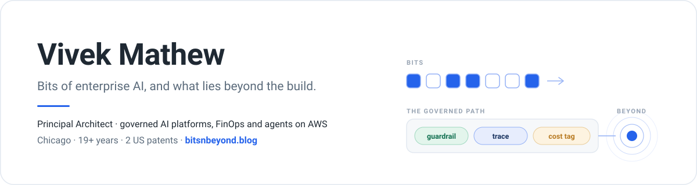

<picture>
  <source media="(prefers-color-scheme: dark)" srcset="assets/banner-dark.svg">
  
</picture>

  
  
  
  

<table>
<tr>
<td width="58%" valign="top">

### What I do

I build the platforms that let large organizations adopt AI without losing control of it: governed model access, cost attribution, observability, and agent infrastructure on AWS. 19+ years across cloud platforms, distributed systems, and applied AI. Principal Architect at Fifth Third Bank, ex-AWS, two US patents.

### Working on

- 🏦 **Enterprise AI platform** – a governed path to Amazon Bedrock for a regulated bank: guardrails at the invocation layer, inference profiles for cost attribution, mandatory tracing, and a VS Code extension that gets engineers a compliant model call in minutes.
- 💸 **FinOps for LLMs** – per-team token cost, prompt-caching discipline, [the four kinds of repeated tokens](https://www.bitsnbeyond.blog/tech/ai/architecture/2026/09/12/four-kinds-of-repeated-tokens.html).
- 🤖 **Agents in production** – harness design, MCP tool governance, [where Bedrock AgentCore fits](https://www.bitsnbeyond.blog/tech/ai/architecture/2026/09/10/the-agent-harness-explained.html).
- 🚀 Building toward a product of my own.

</td>
<td width="42%" valign="top">

### Certified

### Start here

- [AI governance is the new cloud security](https://www.bitsnbeyond.blog/tech/ai/governance/2024/09/01/ai-governance-is-the-new-cloud-security.html) — the series opener
- [How to talk to a risk committee about AI](https://www.bitsnbeyond.blog/tech/ai/governance/leadership/2026/08/15/how-to-talk-to-a-risk-committee-about-ai.html) — controls as evidence
- [The agent harness, explained](https://www.bitsnbeyond.blog/tech/ai/architecture/2026/09/10/the-agent-harness-explained.html) — build vs adopt

</td>
</tr>
</table>

## Latest from the blog

<!-- BLOG-POST-LIST:START -->- [Who Did It? Identity and Least Privilege for AI Agents](https://www.bitsnbeyond.blog/tech/ai/architecture/2026/09/14/agent-identity-and-least-privilege.html) · Sep 14, 2026- [Four Kinds of Repeated Tokens, and Four Ways to Stop Paying for Them](https://www.bitsnbeyond.blog/tech/ai/architecture/2026/09/12/four-kinds-of-repeated-tokens.html) · Sep 12, 2026- [The Agent Harness, Explained: What It Is, and Which Parts Bedrock and AgentCore Give You](https://www.bitsnbeyond.blog/tech/ai/architecture/2026/09/10/the-agent-harness-explained.html) · Sep 10, 2026- [Bedrock AgentCore in Practice: What the Managed Primitives Buy You, and What They Don’t](https://www.bitsnbeyond.blog/tech/ai/architecture/2026/09/02/bedrock-agentcore-in-practice.html) · Sep 2, 2026- [How to Say No to an Executive’s AI Demo Without Losing the Executive](https://www.bitsnbeyond.blog/tech/ai/leadership/2026/08/30/how-to-say-no-to-an-executive-ai-demo.html) · Aug 30, 2026<!-- BLOG-POST-LIST:END -->

## Background

- 💼 Principal Architect, Fifth Third Bank (2024–) · Senior Cloud Application Architect, AWS (2022–24) · Senior Architect, Big Compass (2021–22) · Principal Architect, Discover (2020–21)
- 📜 Inventor on two approved US patents: [US11886278B2](https://patents.google.com/patent/US11886278B2/en) (MLOps) and [US11868749B2](https://patents.google.com/patent/US11868749B2/en) (streaming)
- 🏡 Chicago, USA
- 💬 Ask me about AI governance, Bedrock and AgentCore, agent architecture, or AWS application development and IaC

## Toolbox

### AI stack

<!-- Optional: official AWS service icons. Download the AWS Architecture Icons pack
     (https://aws.amazon.com/architecture/icons/), copy the Bedrock and AgentCore SVGs into
     assets/ in this repo, then uncomment:

  
  

-->

### Observability

### Cloud & platform

### Languages & frameworks

### Data

### DevOps & tooling

## Off the clock

Biking 🚴, running 🏃, and walking 🚶. Formula 1 🏎️, soccer ⚽, cricket 🏏, basketball 🏀, and American football 🏈 (recent Chicago Bears convert).

---

*Opinions here are my own and don't represent my employer.*
